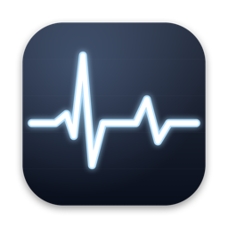
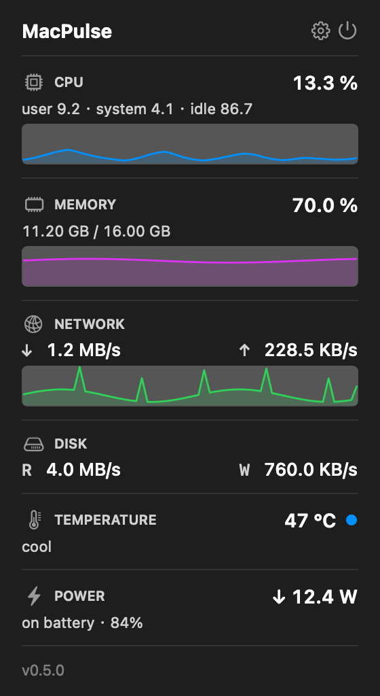
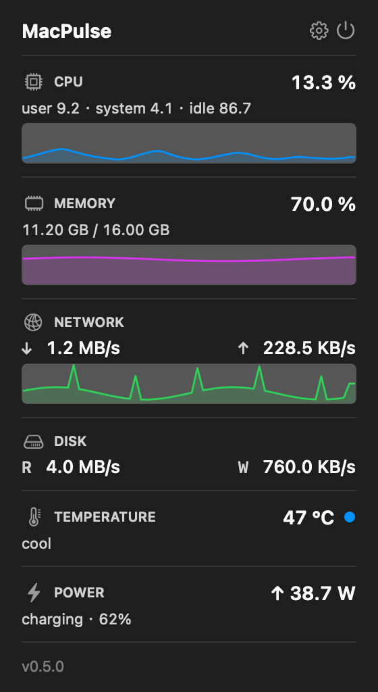
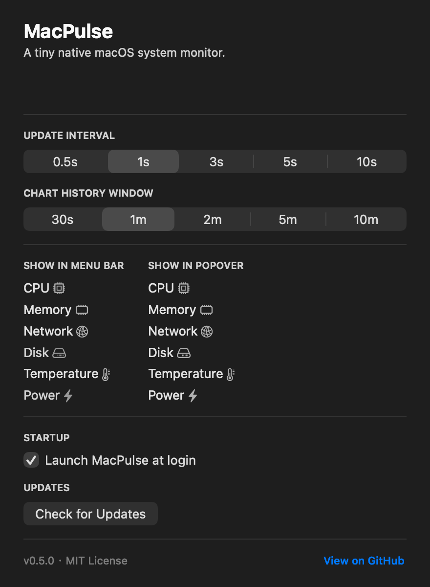

<div align="center">



# MacPulse

**A tiny native macOS menu bar app that gives you a live pulse of your machine.**

CPU · Memory · Network · Disk · Temperature · Power — at a glance, in one click.

No Electron. No background daemon. Just a single Swift binary that sits quietly in your menu bar.

<br />



</div>

---

## Features

| | |
|---|---|
| **CPU** | total %, with user / system / idle breakdown + rolling sparkline |
| **Memory** | % and `used / total` GB, computed the way Activity Monitor does (`active + wired + compressed`) |
| **Network** | live ↓ / ↑ rates across all physical interfaces — `lo`, `utun`, `awdl`, `bridge` excluded |
| **Disk** | read / write bytes per second across every `IOBlockStorageDriver` device |
| **Temperature** | live CPU °C from on-die thermal sensors; falls back to Apple's thermal-pressure level |
| **Power** | charge wattage when plugged in, draw wattage when on battery — read from `AppleSmartBattery` |

Every metric can be **toggled independently** in the menu bar and in the popover via a dedicated Settings window.

<br />

<table>
<tr>
<td align="center"><b>On battery</b><br /></td>
<td align="center"><b>Charging</b><br /></td>
</tr>
</table>

The status bar text adapts to your selection. With the default loadout it reads:

```
   CPU 12%  RAM 47%  ↓12W
   ↓ 1.2M  ↑ 234K
```

The bottom row appears only when at least one rate-style metric (Network / Disk) is enabled.

## Settings

A dedicated window for picking which metrics show where, the sample interval, the chart history window, launch-at-login, and in-app updates.

<div align="center">

</div>

## Requirements

- macOS 13 (Ventura) or newer
- Swift 5.9+ toolchain (Xcode 15 or the Command Line Tools)

## Install

### Option 1 — Prebuilt `.app` (easiest)

Grab the latest `MacPulse-vX.Y.Z.zip` from the [Releases page](../../releases),
unzip, and drag `MacPulse.app` into `/Applications`.

The binary is ad-hoc signed (not notarized), so the first launch needs:
**right-click `MacPulse.app` → Open → Open**.

### Option 2 — Build from source

```bash
git clone https://github.com/daniel29348679/MacPulse.git
cd MacPulse

# Quick run (debug build)
swift run -c release

# Or bundle into a real .app with the icon baked in
scripts/make-icon.swift          # one-off, regenerates Resources/AppIcon.icns
scripts/build-app.sh             # produces ./MacPulse.app
open MacPulse.app
```

The first build takes ~30s; after that startup is instant.

## How it works

| Metric  | Source                                                            |
| ------- | ----------------------------------------------------------------- |
| CPU         | `host_statistics(HOST_CPU_LOAD_INFO)` — diff of user/system/idle ticks between samples |
| Memory      | `host_statistics64(HOST_VM_INFO64)` — `(active + wired + compressed) × page_size`      |
| Network     | `getifaddrs()` + `if_data` — diff of `ifi_ibytes` / `ifi_obytes` between samples       |
| Disk        | IOKit `IOBlockStorageDriver.Statistics` — diff of `Bytes (Read)` / `Bytes (Write)`     |
| Temperature | `IOHIDEventSystemClient` — enumerate `kHIDPage_AppleVendor / TemperatureSensor` services |
| Power       | IOKit `AppleSmartBattery` registry entry — `Voltage × Amperage`, plus `IsCharging` / `ExternalConnected` for direction |

> **About the temperature reading.** Apple does not expose CPU °C through any public API.
> We use `IOHIDEventSystemClient` (private but linkable from `IOKit.framework`) to enumerate
> all HID temperature sensors. On Apple Silicon, names like `PMU tdie0`–`PMU tdie14` are the
> on-die sensors, and we report the maximum value across them as "CPU temperature." This is
> the same trick the popular open-source [Stats](https://github.com/exelban/stats) app uses.
> It works without entitlements but uses unpublished symbols, so a future macOS release
> *could* break it. When it does, the app falls back to `ProcessInfo.processInfo.thermalState`
> (Cool / Warm / Hot / Critical), which is the only public API for thermal info.
>
> Run `MacPulse.app/Contents/MacOS/MacPulse --dump-sensors` to print every readable sensor.

> **About power.** When charging, MacPulse shows the wattage flowing **into** the battery; when
> on battery, the wattage flowing **out**. Plugged in but battery full → the section shows `AC`
> (effective draw on the cells is ≈ 0). Desktop Macs (Mac mini / iMac / Studio) have no battery,
> so the section reads `—`. Numbers are computed from `Voltage × Amperage` reported by
> `AppleSmartBattery`; we always display the absolute value because the sign convention for
> `Amperage` differs across Mac generations.

Default sampling interval: **1 second**. Change it from the right-click menu or the
Settings window; allowed values are 0.5 / 1 / 3 / 5 / 10 s, persisted via `UserDefaults`.

## Project layout

```
MacPulse/
├── Package.swift
├── Resources/
│   └── AppIcon.icns                 # generated by scripts/make-icon.swift
├── scripts/
│   ├── build-app.sh                 # bundle MacPulse.app for local use
│   └── make-icon.swift              # render the app icon from CoreGraphics
├── docs/                            # README screenshots
└── Sources/MacPulse/
    ├── main.swift                   # NSApplication entry point + CLI flags
    ├── AppDelegate.swift
    ├── Settings.swift               # UserDefaults-backed prefs + Metric enum
    ├── Screenshots.swift            # offscreen render mode for marketing shots
    ├── Monitors/
    │   ├── CPUMonitor.swift
    │   ├── MemoryMonitor.swift
    │   ├── NetworkMonitor.swift
    │   ├── DiskMonitor.swift
    │   ├── TemperatureMonitor.swift
    │   ├── TemperatureSensors.swift # IOHIDEventSystemClient bridge
    │   ├── PowerMonitor.swift       # AppleSmartBattery via IOKit
    │   └── Formatter.swift
    └── UI/
        ├── StatusBarController.swift
        ├── StatsPopoverController.swift
        ├── SettingsWindowController.swift
        └── SparklineView.swift
```

## Roadmap

- [x] Disk I/O monitoring
- [x] Sparkline charts in the popover
- [x] Configurable update interval
- [x] Toggle which metrics show in the menu bar / popover
- [x] Thermal state indicator
- [x] On-die °C temperature reading
- [x] Battery charge / discharge wattage
- [x] App icon
- [ ] GPU usage (Apple Silicon)
- [ ] Per-core CPU breakdown
- [ ] Notarized `.app` bundle in releases

PRs welcome.

## License

[MIT](LICENSE)
